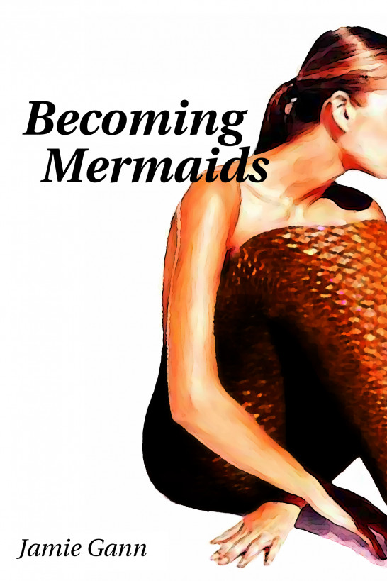

# Mermaid transformation stories

All of these are free, complete ebooks, written by Jamie Gann, hosted here so that the epub is easy to download. I hope you enjoy reading them!

## A Tail in Winter (2026) [[EPUB](https://raw.githubusercontent.com/jamie-gann2/stories/refs/heads/main/a-tail-in-winter.epub)] [[Wattpad](https://www.wattpad.com/story/407021530-a-tail-in-winter)]

When Mira tries a mysterious "self-care" potion, she winds up with scales, a fishtail-and cravings she never imagined. But magic always has a catch, and her newfound freedom may come at a cost she never expected.

## Becoming Mermaids (2017) [[EPUB](https://raw.githubusercontent.com/jamie-gann2/stories/refs/heads/main/becoming-mermaids.epub)] [[Wattpad](https://www.wattpad.com/story/106379211-becoming-mermaids)]

What would it be like to turn into a mermaid? To feel the same blood flow in your fingers as in the tips of your tail?

Samantha wasn't expecting to find out when she rescued what she thought was a drowning woman, only to have the tides turned. And she certainly wasn't prepared for the depth of the changes as she sank more deeply- and more irreversibly- into the mermaid's world.

## The Fish-Witch (sometime in the 90's) [[EPUB](https://raw.githubusercontent.com/jamie-gann2/stories/refs/heads/main/fish-witch.epub)] [[Wattpad](https://www.wattpad.com/story/210254967-the-fish-witch)]

_(Rescued from an old hard drive!)_

Amy thought the worst thing that could happen on a bad night out was an awkward rejection. Instead, she meets a witch who wants a friend, a ride, and help becoming a mermaid.

The magic works. Just not the way it’s supposed to.

A story about unintended transformations, sapphic tension, bad decisions made with good intentions, and what happens when someone else’s dream rewrites your life.
